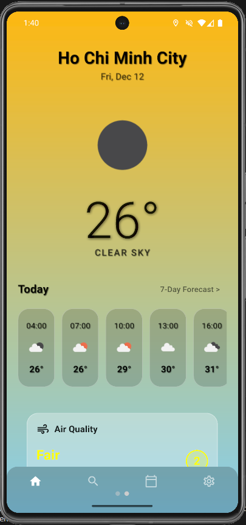
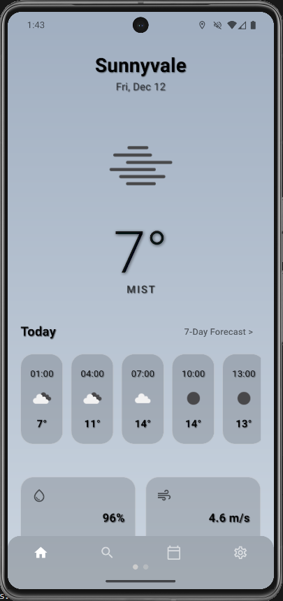
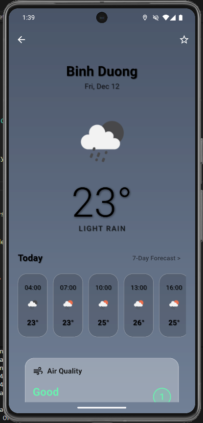
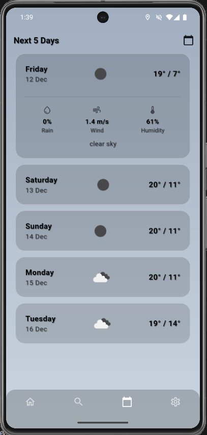
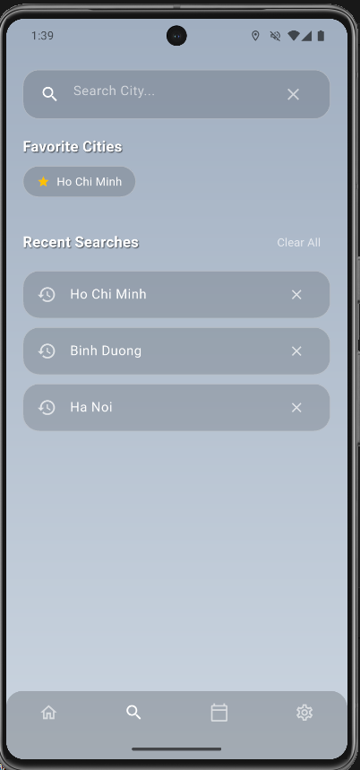
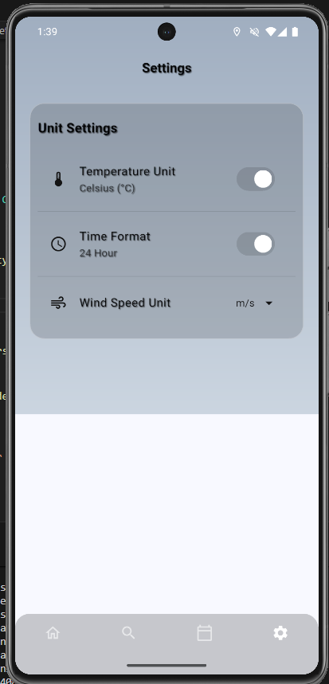
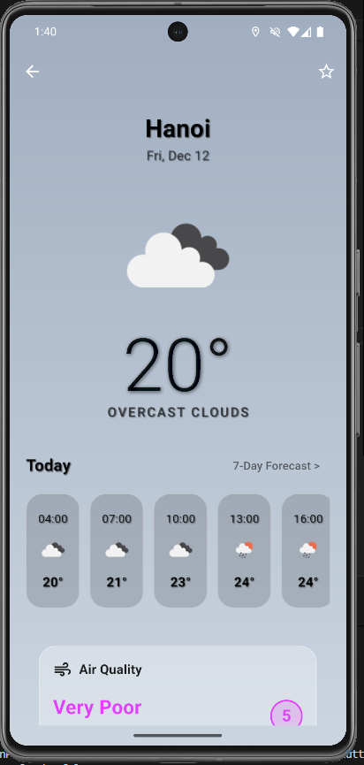

# Flutter Weather App 🌦️

> **Bài tập Lab 4 - Lập trình thiết bị di động**

## 🎬 Video Demo
Xem video demo của ứng dụng tại đây:
**https://drive.google.com/drive/folders/1AaKEt2AzkPsr0emnQ-ejXI90V6hamJ37?usp=sharing**

## 📖 Mô tả dự án
Đây là ứng dụng theo dõi thời tiết toàn diện được xây dựng bằng **Flutter**. Ứng dụng cung cấp dữ liệu thời tiết theo thời gian thực, dự báo 7 ngày tiếp theo và tự động cập nhật giao diện dựa trên điều kiện thời tiết (Nắng, Mưa, Mây, Đêm).

Dự án áp dụng các kỹ thuật quan trọng như **RESTful API**, **State Management (Provider)**, **Offline Caching**, và phong cách thiết kế **Glassmorphism** hiện đại.

## ✨ Tính năng chính
* **📍 Định vị tự động:** Tự động lấy dữ liệu thời tiết tại vị trí hiện tại của người dùng qua GPS.
* **search Tìm kiếm thông minh:** Tìm kiếm thành phố, lưu lịch sử tìm kiếm và quản lý danh sách thành phố yêu thích (tối đa 5 thành phố).
* **📅 Dự báo 5 ngày: (bản pro mới có 7 ngày)** Hiển thị dự báo chi tiết cho tuần tới (Nhiệt độ Min/Max, Mưa, Gió).
* **🎨 Giao diện động (Dynamic UI):** Màu nền và hiệu ứng thay đổi theo thời tiết (Trời nắng nền xanh vàng, Trời mưa nền xám tối...).
* **⚙️ Cài đặt tùy chỉnh:** Cho phép đổi đơn vị nhiệt độ (°C/°F), tốc độ gió (m/s, km/h, mph) và định dạng giờ (12h/24h).
* **📶 Hỗ trợ Offline:** Tự động lưu cache dữ liệu. Khi mất mạng, ứng dụng vẫn hiển thị dữ liệu cũ và thông báo cho người dùng.

## 🛠 Công nghệ sử dụng
* **Framework:** Flutter & Dart
* **State Management:** `provider`
* **Networking:** `http` (Tích hợp OpenWeatherMap API)
* **Local Storage:** `shared_preferences` (Lưu Cache & Settings)
* **Location:** `geolocator`, `geocoding`
* **Environment:** `flutter_dotenv` (Bảo mật API Key)
* **UI Components:** `cached_network_image`, `intl`, `google_fonts`

## 📸 Ảnh chụp màn hình (Screenshots)

| Màn hình chính (Nắng) | Màn hình chính (Sương) | Màn hình (Mưa) |
|:---:|:---:|:---:|
|  |  |  |

| Dự báo 5 ngày | Tìm kiếm & Yêu thích | Cài đặt & Đơn vị |
|:---:|:---:|:---:|
|  |  |  |

| Dự báo 5 ngày |
|:---:|
|  |

> *Lưu ý: Ảnh chụp màn hình chi tiết được lưu trong thư mục `screenshots/`.*

## 🚀 Hướng dẫn cài đặt & Chạy

### 1. Yêu cầu tiên quyết
* Flutter SDK đã được cài đặt.
* Một tài khoản OpenWeatherMap (để lấy API Key miễn phí).

### 2. Thiết lập API Key (Bảo mật)
⚠️ **Quan trọng:** Không bao giờ commit file `.env` chứa key thật lên GitHub.

1.  Đổi tên file `.env.example` thành `.env`:
    ```bash
    cp .env.example .env
    ```
2.  Mở file `.env` và điền API Key của bạn vào:
    ```env
    OPENWEATHER_API_KEY=your_actual_api_key_here
    ```

### 3. Chạy ứng dụng
Mở terminal tại thư mục gốc của dự án và chạy các lệnh:

```bash
# Tải các thư viện phụ thuộc
flutter pub get

# Chạy ứng dụng (đảm bảo máy ảo Android/iOS đã mở)
flutter run
```
